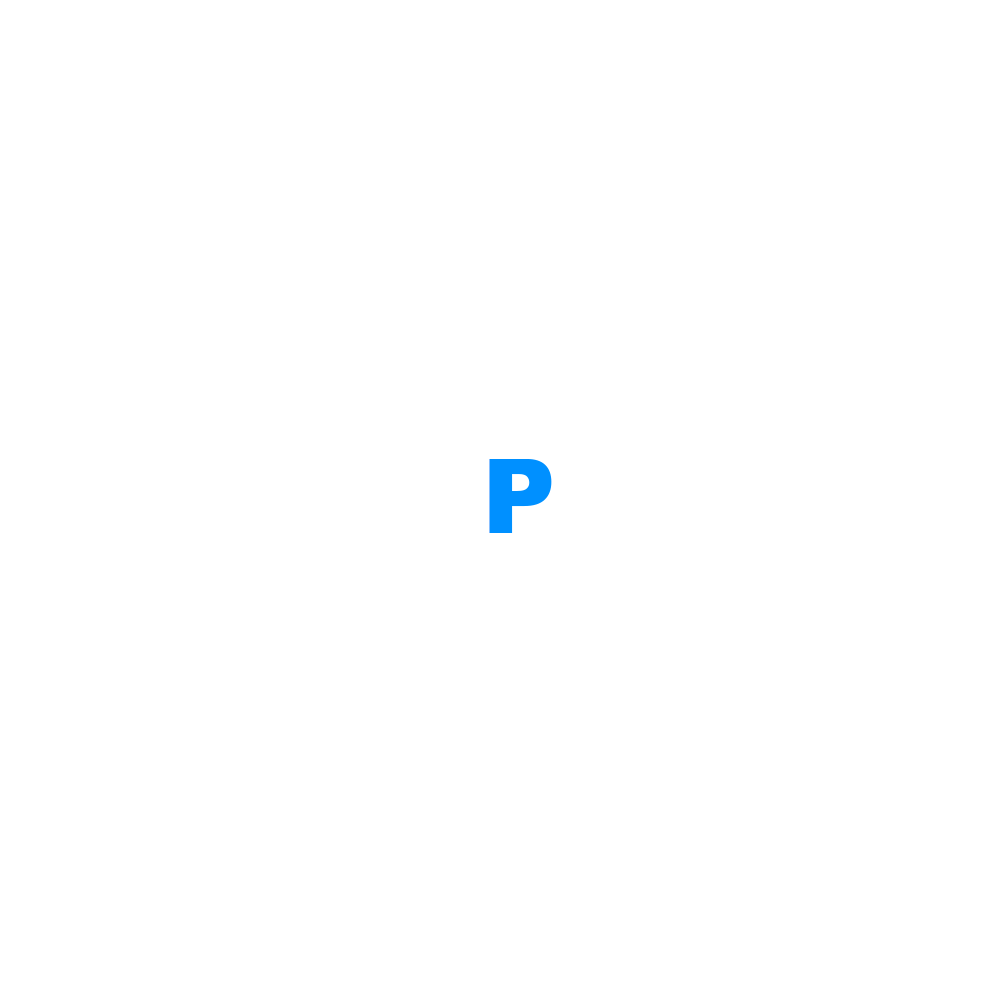

<!-- Improved compatibility of back to top link: See: https://github.com/othneildrew/Best-README-Template/pull/73 -->

<!--
*** Thanks for checking out the Best-README-Template. If you have a suggestion
*** that would make this better, please fork the repo and create a pull request
*** or simply open an issue with the tag "enhancement".
*** Don't forget to give the project a star!
*** Thanks again! Now go create something AMAZING! :D
-->

<!-- PROJECT SHIELDS -->
<!--
*** I'm using markdown "reference style" links for readability.
*** Reference links are enclosed in brackets [ ] instead of parentheses ( ).
*** See the bottom of this document for the declaration of the reference variables
*** for contributors-url, forks-url, etc. This is an optional, concise syntax you may use.
*** https://www.markdownguide.org/basic-syntax/#reference-style-links
-->
[![Contributors][contributors-shield]][contributors-url]
[![Forks][forks-shield]][forks-url]
[![Stargazers][stars-shield]][stars-url]
[![Issues][issues-shield]][issues-url]
[![project_license][license-shield]][license-url]
[![LinkedIn: Metehan Günen][linkedin-shield-meto]][linkedin-url-meto]
[![LinkedIn: Semih Çelenk][linkedin-shield-semih]][linkedin-url-semih]
[![LinkedIn: Emre Kaygusuz][linkedin-shield-emre]][linkedin-url-emre]

<!-- PROJECT LOGO -->
 

  

<h3 align="center">ENPAS</h3>

  

    Engelsiz Park Sistemleri
     
    <a href="https://github.com/Metrohan/ENPAS"><strong>Dosyaları incele »</strong></a>
     
     
  

<!-- TABLE OF CONTENTS -->

  
İçerik

  <ol>
    <li>
      <a href="#about-the-project">Proje Hakkında</a>
      <ul>
        <li><a href="#built-with">Kullanılan Teknolojiler</a></li>
      </ul>
    </li>
    <li><a href="#roadmap">Roadmap</a></li>
    <li><a href="#contact">İletişim</a></li>
    <li><a href="#acknowledgments">Acknowledgments</a></li>
  </ol>

<!-- ABOUT THE PROJECT -->
## Proje Hakkında

[![Görsel Hazırlanıyor][product-screenshot]](https://example.com)

Engelli bireyler için otoparklarda yer alan park alanlarının daha etkili
korunması ve yetkisiz kullanımların engellenmesi amacıyla bir duba kontrol
sistemi geliştirilecektir. Sistem, bir mobil uygulama aracılığıyla dubaların
yükseltilip alçaltılmasını sağlayacak, sadece doğrulanmış engelli bireyler
tarafından kullanılabilecektir.

### Kullanılan Teknolojiler

* [![Kotlin][Kotlin]][Kotlin-url]
* [![Android Studio][Android Studio]][AndroidStudio-url]
* [![Firebase][Firebase]][Firebase-url]
* ![ESP32][ESP32]

(<a href="#readme-top">başa dön</a>)

<!-- USAGE EXAMPLES -->
## Kullanım

Uygulama hazır olduğunda doldurulacak

(<a href="#readme-top">başa dön</a>)

<!-- ROADMAP -->
## Roadmap

### **Genel Roadmap**

#### **1. Hazırlık Aşaması**
1. **Proje Tanımı ve Hedef Belirleme**:
- Ekip bir toplantı yaparak projenin nihai hedeflerini ve kullanıcı
hikayelerini (Admin, Engelli birey, Normal birey) belirlenecek.
- Projenin temel teknik ve yazılım gereksinimlerini tespit edilecek.
- Belirlenen gereksinimlere göre bir yol haritası oluşturulacak.  
2. **Roller ve Sorumluluk Dağılımı**:
- Yazılım ekibi (4 kişi): Kotlin ve Android Studio öğrenmeye başlayacak.
- Donanım ekibi (Semih ve Metehan): ESP32 ve DC motorlarla prototip
geliştirme için çalışacak.  
3. **Kaynak Araştırması ve Temini**:
- ESP32, DC motor, Wi-Fi modülü gibi donanım bileşenlerini tedarik
edilecek.
- Kotlin ve Android Studio için gerekli kaynakları belirlenecek (video
dersler, dökümanlar, tutorial projeler). 
4. **Ekip Eğitim Planı**:
- Kotlin ve Android Studio için haftalık ders ccalısılacak (Genel bilgi
edinildiğinde proje geliştirme aşamasında devam edilecek)
- ESP32 ve DC motorlar üzerine bir temel çalışma yapılacak.
---
#### **2. Teknoloji ve Araştırma Aşaması**
1. **Kotlin ve Android Studio Öğrenimi**:
- Haftalık bireysel ve grup çalışmaları yapılacak.
- Temel konular:
- Aktivite ve fragment kullanımı.
- RecyclerView ve View Binding.
- Google Maps API entegrasyonu.
- Firebase veya SQLite kullanımı.
2. **ESP32 ve DC Motorlar**:
- DC motor kontrolü için ESP32 kodlama.
- Wi-Fi modülü ile ESP32’nin mobil cihazlarla haberleşmesi.
3. **Araştırma ve Test**: // (Asıl projeden önce basit ve entegre edilebilir alt
sistemler oluşturulacak)
- Google Maps API için demo projeler geliştirme. (// Pratik ve doğruluk
testi)
- ESP32’yi kontrol edebilen basit bir mobil uygulama çıkartılacak.
---
#### **3. Prototip Geliştirme**
1. **Donanım Prototipi** :
- ESP32 tabanlı DC motor sistemini tamamlanacak.
- Wi-Fi haberleşmesini sağlanacak.
2. **Mobil Uygulama Tasarımı**:
- Login ekranı ve profil ekranlarını tasarlanacak.
- Harita ekranı için Google Maps API entegrasyonu.
3. **Donanım-Yazılım Entegrasyonu** :
- Mobil uygulamayı Arduino’ya bağlayarak servo motorun kontrol edilmesini
sağlanacak.
- // Donanım ve yazılımın işlevi ve entegrasyonu test edilecek.
---
#### **4. Test ve İyileştirme** (// GENEL BUG FIX)
1. **Testler**:
- Sistem çalışabilirliğini kontrol edilecek.
- Donanım ve yazılım uyumunu test edilecek.
- Harita ekranındaki verileri kontrol edilecek.
2. **Hata Ayıklama**:
- Kullanıcı deneyiminden gelen geri bildirimlere göre iyileştirme yapılacak.
- Sistem performansını artıracak düzenlemeler gerçekleştirilecek.
---
#### **5. Sunum ve Dokümantasyon** (// SON AŞAMA)
1. **Doküman Hazırlığı**:
- Proje amacı, teknik detaylar ve test sonuçlarını içeren bir rapor
yazılacak.
2. **Sunum**:
- Teknofest jürisi için etkili bir sunum hazırlanacak.
- Sistem çalışma videosu veya demoyu sunuma dahil edilecek.

### **Uygulama Roadmap'i**

#### **1. Login ve Profil Sistemi:**
- Kullanıcıların giriş yapmasını sağlayacak bir kimlik doğrulama sistemi.
- Rol tabanlı erişim yönetimi (Admin, Engelli Birey, Normal Kullanıcı).
- Belge yükleme ve onay sistemi.
- Profil bilgilerini düzenleme ve şifre değiştirme özellikleri.
#### **2. Ana Ekran (Home):**
- Kullanıcıya özel içeriklerin listelendiği bir alan.
- **Bülten Sekmesi:** Yeni duyurular, haberler ve güncellemeler.
- **Sistem Bilgilendirme:** Uygulamanın işleyişi ve kullanım rehberleri.
- **İçerik Listesi:** Önemli bilgiler ve ipuçları.
- Otopark durumu (dolu/boş) bilgisi.
#### **3. Harita Entegrasyonu:**
- Google Maps API kullanılarak engelli park alanlarının konumlarının gösterimi.
- Park alanlarının seçilmesi ve detay bilgilerinin görüntülenmesi.
#### **4. Duba Kontrol Sistemi:**
- Yetkili kullanıcıların dubaların durumunu kontrol edebilmesi.
- Gerçek zamanlı iletişim (Wi-Fi).
#### **5. Bildirim Sistemi:**
- Otopark doluluk durumu ve belge onay/ret bildirimleri.
#### **6. Ayarlar Sekmesi:**
- Genel ayarlar ve dil tercihleri.
- Yardım ve destek bağlantıları.
---
### **Backend ve Frontend Ayrımı**
#### **Frontend (Kullanıcı Arayüzü):**
- **Teknolojiler:** Kotlin, XML (UI tasarımı için), Android Jetpack.
- **Sorumluluklar:**
- Kullanıcı dostu arayüzler oluşturmak.
- Dinamik içeriklerin kullanıcı rolüne göre yüklenmesi.
- Harita entegrasyonu ve kullanıcı giriş ekranlarının görsel tasarımı.
#### **Backend (Sunucu ve İş Mantığı):**
- **Teknolojiler:** Firebase (Authentication, Realtime Database), Node.js
(alternatif olarak).
- **Sorumluluklar:**
- Kullanıcı verilerinin doğrulanması ve yönetimi.
- Duba kontrol ve bildirim sistemlerinin gerçek zamanlı işleyişi.
- API entegrasyonları ve veri işlemleri.
---
### **Sistem Arayüzü Tasarımı**
#### **Ana Ekran:**
- **Bültenler:** Güncellemeler ve haberler.
- **Hızlı Erişim:** Duba kontrol sistemi, harita ekranı ve bildirimler.
#### **Harita Ekranı:**
- Park alanlarının konumlarını gösteren interaktif harita.
- Her park alanı için bilgi penceresi (dolu/boş durumu, erişim kolaylığı).
#### **Ayarlar Ekranı:**
- Genel uygulama ayarlarının düzenlenebileceği alan.
- Yardım ve destek bağlantıları.
#### **Duba Kontrol Ekranı:**
- Dubaların durumu hakkında bilgi.
- Kontrol butonları ile duba hareketlerinin yönetimi.
---
### **Geliştirme Süreci**
#### **1. Planlama ve Hazırlık**
1. **Gereksinim Analizi:**
- Kullanıcı hikayelerini oluşturma.
- Uygulama akışı ve modüllerin belirlenmesi.
2. **Teknik Araştırma:**
- Android Studio ve Kotlin öğrenimi.
- Firebase ve Google Maps API kullanım kılavuzlarının incelenmesi.
3. **Proje Yapılandırması:**
- Frontend ve backend görevlerinin ayrıştırılması.
---
#### **2. Geliştirme Aşaması**
1. **Login ve Profil Sistemi:**
- Firebase Authentication ile kullanıcı girişi.
- Belge yükleme ve onay modülü.
2. **Ana Ekran:**
- Kullanıcı rolüne uygun dinamik içeriklerin oluşturulması.
- Otopark durumu ve bülten sekmeleri.
3. **Harita Entegrasyonu:**
- Google Maps API ile park alanlarının interaktif gösterimi.
4. **Duba Kontrol Sistemi:**
- Wi-Fi modülü ile gerçek zamanlı kontrol.
5. **Bildirim Sistemi:**
- Firebase Cloud Messaging ile anlık bildirimler.
---
#### **3. Test ve Hata Ayıklama**
1. **Unit Testleri:** 
- Her modülün bağımsız olarak test edilmesi.
2. **Entegrasyon Testleri:** 
- Sistem modüllerinin birlikte çalışma durumlarının
test edilmesi.
3. **Kullanıcı Testleri:** 
- Pilot kullanıcılarla test.
  
(<a href="#readme-top">başa dön</a>)

---

<!-- LICENSE -->
## Lisans

`LICENSE.txt`'yi inceleyebilirsiniz.

(<a href="#readme-top">başa dön</a>)

<!-- CONTACT -->
## İletişim

Metehan Günen - metehangnn@outlook.com
 
Emre Kaygusuz - 
 
Semih Çelenk - 
 
Musa Emre Delen - 
 
Ali Karaca - 

Proje linki: [https://github.com/Metrohan/ENPAS](https://github.com/Metrohan/ENPAS)

(<a href="#readme-top">başa dön</a>)

<!-- ACKNOWLEDGMENTS -->
## Acknowledgments

* 
* 
* 

(<a href="#readme-top">başa dön</a>)

<!-- MARKDOWN LINKS & IMAGES -->
<!-- https://www.markdownguide.org/basic-syntax/#reference-style-links -->
[contributors-shield]: https://img.shields.io/github/contributors/Metrohan/ENPAS.svg?style=for-the-badge
[contributors-url]: https://github.com/Metrohan/ENPAS/graphs/contributors
[forks-shield]: https://img.shields.io/github/forks/Metrohan/ENPAS.svg?style=for-the-badge
[forks-url]: https://github.com/Metrohan/ENPAS/network/members
[stars-shield]: https://img.shields.io/github/stars/Metrohan/ENPAS.svg?style=for-the-badge
[stars-url]: https://github.com/Metrohan/ENPAS/stargazers
[issues-shield]: https://img.shields.io/github/issues/Metrohan/ENPAS.svg?style=for-the-badge
[issues-url]: https://github.com/Metrohan/ENPAS/issues
[license-shield]: https://img.shields.io/github/license/Metrohan/ENPAS.svg?style=for-the-badge
[license-url]: https://github.com/Metrohan/ENPAS/blob/main/LICENSE.txt
[linkedin-shield-meto]: https://img.shields.io/badge/-LinkedIn:MetehanGunen-black.svg?style=for-the-badge&logo=linkedin&colorB=555
[linkedin-shield-semih]: https://img.shields.io/badge/-LinkedIn:SemihCelenk-black.svg?style=for-the-badge&logo=linkedin&colorB=555
[linkedin-shield-emre]: https://img.shields.io/badge/-LinkedIn:EmreKaygusuz-black.svg?style=for-the-badge&logo=linkedin&colorB=555
[linkedin-url-meto]: https://www.linkedin.com/in/metehangunen/
[linkedin-url-semih]: https://www.linkedin.com/in/semih-celenk/
[linkedin-url-emre]: https://www.linkedin.com/in/emre-kaygusuz-56b014250/
[product-screenshot]: images/screenshot.png
[Kotlin]: https://img.shields.io/badge/Kotlin-000000?style=for-the-badge&logo=kotlin&logoColor=green
[Kotlin-url]: https://kotlinlang.org/
[Android Studio]: https://img.shields.io/badge/androidstudio-20232A?style=for-the-badge&logo=androidstudio&logoColor=61DAFB
[AndroidStudio-url]: https://developer.android.com/studio?hl=en
[Firebase]: https://img.shields.io/badge/firebase-35495E?style=for-the-badge&logo=firebase&logoColor=orange
[Firebase-url]: https://firebase.google.com/
[ESP32]: https://img.shields.io/badge/esp32-DD0031?style=for-the-badge&logo=esp32&logoColor=white
[Svelte.dev]: https://img.shields.io/badge/Svelte-4A4A55?style=for-the-badge&logo=svelte&logoColor=FF3E00
[Svelte-url]: https://svelte.dev/
[Laravel.com]: https://img.shields.io/badge/Laravel-FF2D20?style=for-the-badge&logo=laravel&logoColor=white
[Laravel-url]: https://laravel.com
[Bootstrap.com]: https://img.shields.io/badge/Bootstrap-563D7C?style=for-the-badge&logo=bootstrap&logoColor=white
[Bootstrap-url]: https://getbootstrap.com
[JQuery.com]: https://img.shields.io/badge/jQuery-0769AD?style=for-the-badge&logo=jquery&logoColor=white
[JQuery-url]: https://jquery.com 
